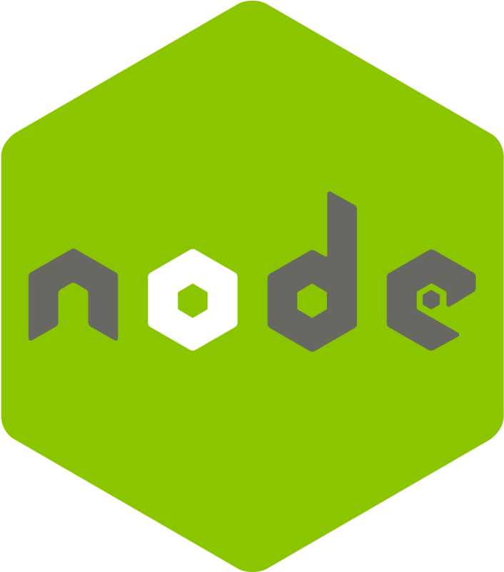
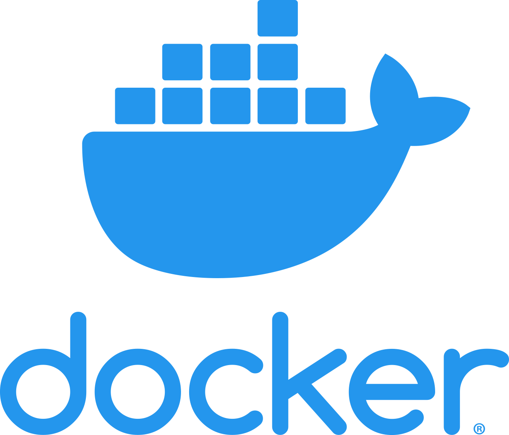

<h1>Hi 👋, I'm Ajinkya</h1>
<h3>A software engineer from Mumbai, India</h3>

## :pushpin: Skills
- 👨‍💻 JavaScript
- ⚙️ ReactJS, NodeJS
- 👁️ CSS, Bootstrap
- 💽 MongoDB

# 💻 Recent Projects 

### ReactJS Projects
- Task Tracker [:memo:](https://github.com/ajinkyacodes/reactjs-task-tracker)

### JavaScript Apps [:memo:](https://github.com/ajinkyacodes/javascript-apps)
- Spotify Playlist [:globe_with_meridians:](https://ajinkyacodes.github.io/javascript-apps/spotify-playlist/)
- Expense Tracker [:globe_with_meridians:](https://ajinkyacodes.github.io/javascript-apps/expense-tracker/)
- Movies App [:globe_with_meridians:](https://ajinkyacodes.github.io/javascript-apps/movies-app/)
- Music Player [:globe_with_meridians:](https://ajinkyacodes.github.io/javascript-apps/music-player/)
- Calculator [:globe_with_meridians:](https://ajinkyacodes.github.io/javascript-apps/calculator/)
- Currency Exchange [:globe_with_meridians:](https://ajinkyacodes.github.io/javascript-apps/currency-exchange/)
- TODO List [:globe_with_meridians:](https://ajinkyacodes.github.io/javascript-apps/todolist/)
- Text Reader [:globe_with_meridians:](https://ajinkyacodes.github.io/javascript-apps/text-reader)
- Tic tac Toe [:globe_with_meridians:](https://ajinkyacodes.github.io/javascript-apps/tic-tac-toe-basic/)
- Rock Paper Scissors [:globe_with_meridians:](https://ajinkyacodes.github.io/javascript-apps/rock-paper-scissors/)
- Movie Booking [:globe_with_meridians:](https://ajinkyacodes.github.io/javascript-apps/movie-booking/)
- Drink Water [:globe_with_meridians:](https://ajinkyacodes.github.io/javascript-apps/drink-water/)
- Weather Forecast [:globe_with_meridians:](https://ajinkyacodes.github.io/javascript-apps/weather-forecast/)
- Random Jokes [:globe_with_meridians:](https://ajinkyacodes.github.io/javascript-apps/random-jokes/)
- Password Generator [:globe_with_meridians:](https://ajinkyacodes.github.io/javascript-apps/password-generator/)
- Light/Dark Mode [:globe_with_meridians:](https://ajinkyacodes.github.io/javascript-apps/light-dark-mode/)
- Rotating Navigation [:globe_with_meridians:](https://ajinkyacodes.github.io/javascript-apps/rotating-navigation/)
- Netflix Navigation [:globe_with_meridians:](https://ajinkyacodes.github.io/javascript-apps/netflix-navigation/)
- Infinite Scroll [:globe_with_meridians:](https://ajinkyacodes.github.io/javascript-apps/infinite-scroll/)
- New Year Countdown [:globe_with_meridians:](https://ajinkyacodes.github.io/javascript-apps/new-year-countdown/)

### 🔨 Languages and Tools:

 
